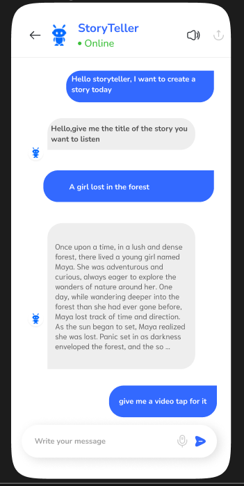
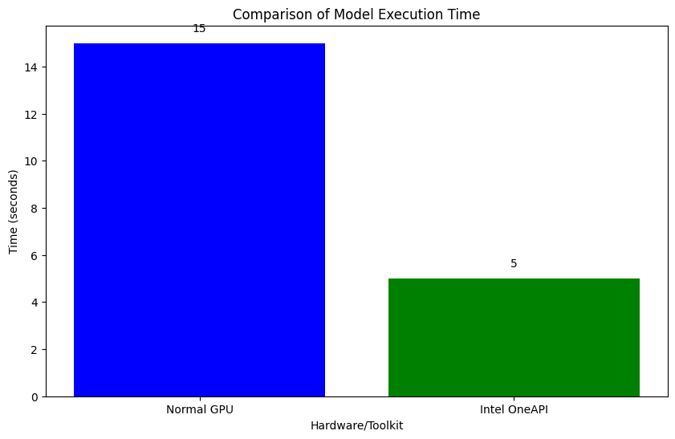

# StoryTeller
The intel OneAPI based storyteller is an interactive way to listen the things that you want and have waht you want at your fingertips fast and precise, this is a AI based chatbot system which can generate images by using the Intel's API toolkit which provide parallelism and efficieny to it. So, let's see what we got in here.

## Prototype Visualization
Logo for storyteller

Interface for storyteller

## Efficiency with OneAPI

Time is one of the key factors that my model outperformed in comparison to normal gpu’s time, and this is done only with the help of Intel One API.There were some of the key modification that helped me:

- Using the Intel optimized pytorch and Intel oneDNN (Deep Neural Network Library) on it’s interface of Intel Developer Cloud, the time and precision of the story creation increased due to multicore CPU processing.
- Using VTune Profile I was able to analyze my code’s performance and identify potential bottlenecks. It also provided me insights on how to optimize your code further.
- Using Intel Threading Building Blocks (TBB) which involves parallelism, i was able to do efficient parallel execution. It provided a high-level abstraction for parallelism and improved performance on multi-core CPUs.

## Installing the necessary libraries

<pre>
!pip install gTTS moviepy diffusers
!pip install torch torchvision
!pip install diffusers["torch"] transformers
!pip install accelerate
!pip install git+https://github.com/huggingface/diffusers
    </pre>
## Story Creation
<pre>
from transformers import pipeline, set_seed
import intel_extension_for_pytorch as ipex
Set up the pipeline
pipe = pipeline("text-generation", model="openai-community/gpt2")
Set the seed for reproducibility
set_seed(42)
Define the text prompt
text = " a boy in the forest"
prompt = "generate a story on the title" + text
{Set the maximum number of tokens}
max_length = 1024
###Generate the story
story = pipe(
    prompt,
    max_length=max_length,
    truncation=True
)[0]['generated_text'][len(prompt)+2:]
print(story)
    </pre>

First we import the intel extension for pytorch for efficient and precise computation,then our code is generating the story using the GPT-2 model by hugging face and some hyperparameter are defined so as to limit the length of the story, these are:

- max_tokens: which tells us about the number of words or letters we limit our data to.
- temperature: Controls the randomness of token sampling.
- top_k: Controls the number of most likely tokens to keep.
- top_p: Controls the nucleus sampling for token selection.
- repetition_penalty: Penalty for repeating tokens.

The generated text is now made precise by formatting it to the way it should be visible

## Sound Creation
<pre>
from gtts import gTTS
narration_text = story
narration = gTTS(text=narration_text, lang='en-us', slow=True, tld='com')
narration.save("narration.mp3")
audio = AudioFileClip("narration.mp3")
duration = audio.duration
</pre>
For the sound generation we have used the google text to sound library provided by hugging face and have optimized it, so that it can give a calming sense with the narration. Then the sound is saved under the name “narration.mp3” for further use.

## Image Creation
<pre>
import torch
from diffusers import StableDiffusionPipeline
pipe = StableDiffusionPipeline.from_pretrained("digiplay/majicMIX_realistic_v6", torch_dtype=torch.float16)
pipe = pipe.to("cuda")
pipe.safety_checker = None
h = 800  (height of the image)
w = 640  (width of the image)
steps = 25  (number of updates the system makes before giving the result, making it more accurate)
guidance = 7.5  (how closely you want the image to be related to the prompt that you have typed)
neg = "easynegative,no repetation, lowres,partial view, bad anatomy, bad hands, text, error, missing fingers, extra digit, fewer digits, cropped, worstquality, low quality, normal quality, jpegartifacts, signature, watermark, username, blurry, bad feet, cropped, poorly drawn hands, poorly drawn face, mutation, deformed, worst quality, low quality, normal quality, jpeg artifacts, signature, watermark, extra fingers, fewer digits, extra limbs, extra arms,extra legs, malformed limbs, fused fingers, too many fingers, long neck, cross-eyed,mutated hands, polar lowres, bad body, bad proportions, gross proportions, text, error, missing fingers, missing arms, missing legs, extra digit, extra arms, extra leg, extra foot,"

prompt=text
num_images=int(duration/3)
for i in range(num_images):
    prompt = prompt
    image = pipe(prompt, height=h, width=w, number_inference_steps=steps, guidance_scale=guidance, negative_prompt=neg).images[0]
    image.save(f"image_{i+1}.png")  # Save the image with a unique name
</pre>

Here is the code for the image generation, i have used the title of the story to generate image related to it and the image is also being optimized by hyperparameter tuning which is:

- steps :number of updates the system makes before giving the result, making it more accurate.
- guidance :how closely you want the image to be related to the prompt that you have typed.
- neg: the list of elements for the image that you don’t want to happen.

## Video Generation
<pre>
video = ColorClip((1280, 720), color=(0, 0, 0), duration=duration)
txt = story
video = video.set_audio(audio)
video = video.set_duration(duration)
video = video.set_fps(24)
video = video.set_audio(audio)
video = video.set_duration(duration)
video = video.set_fps(24)
video = CompositeVideoClip([video])
image_clips = [ImageClip(f"/content/image_{i}.png").set_duration(duration/num_images) for i in range(1, num_images+1)]
images_video = concatenate_videoclips(image_clips, method="compose")
final_video = CompositeVideoClip([video.set_position(('center', 'center')), images_video.set_position(('center', 'center'))])
final_video.write_videofile("story_video.mp4", codec='libx264', fps=24)
</pre>

The video is being compiled up with the content that we have generated the image_clip is collecting all the images that we have created, the audio is setting the narrations that we have created for the given story and then all this is been compiled and saved in the form of a video.

## Role of Intel OneAPI
Time is one of the key factors that my model outperformed in comparison to normal gpu’s time, and this is done only with the help of Intel One API.There were some of the key modification that helped me:

- Using the Intel optimized pytorch and Intel oneDNN (Deep Neural Network Library) on it’s interface of Intel Developer Cloud, the time and precision of the story creation increased due to multicore CPU processing.
- Using VTune Profile I was able to analyze my code’s performance and identify potential bottlenecks. It also provided me insights on how to optimize your code further.
- Using Intel Threading Building Blocks (TBB) which involves parallelism, i was able to do efficient parallel execution. It provided a high-level abstraction for parallelism and improved performance on multi-core CPUs.

## Article
[Interactive storyteller using Intel OneAPI](https://medium.com/@vishesh.bhardwaj.702/interactive-storyteller-using-intel-oneapi-f9fcea940f89)
## Demo Story Link
[Youtube](https://youtu.be/-w3gEJbSEb0?si=lho5Gz7Te9YTnTwM )
## Creator
### Vishesh Bhardwaj
### Surya Kamesh Mantha
